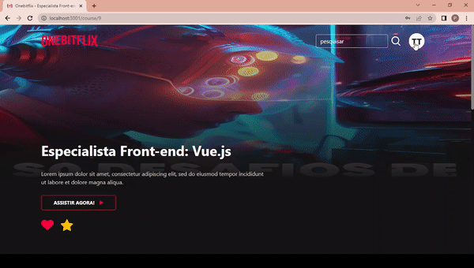

<h1 align="center">  </h1>

Este projeto foi feito em aula do curso da OneBitCode.  

  <a href="#-tecnologias">Tecnologias</a>&nbsp;&nbsp;&nbsp;|&nbsp;&nbsp;&nbsp;
  <a href="#-projeto">Projeto</a>

 

## 🤯 Demonstração

  

  

  

  

  

## 🚀 Tecnologias

Esse projeto foi desenvolvido com as seguintes tecnologias:

- NextJs
- React
- Bootstrap/Reactstrap
- Typescript
- sass
- axios

## 💻 Projeto

Onebitflix é um projeto full-stack desenvolvido no curso da [OneBitCode](https://cursos.onebitcode.com/auth/cadastrar). Nele eu realizei o front-end de uma aplicação EAD de cursos inspirado no netflix. Link do back-end: https://github.com/pdro-h0/onebitflix-back-end

---

## 🤔 Instruções
### Primeiros passos:

Depois de baixar o arquivo no [GitHub](https://github.com/pdro-h0/onebitflix-front-end.git), no seu terminal, execute o seguinte comando na pasta raiz:

`npm install`

Após o primeiro passo, rode o comando no terminal para iniciar o projeto:

`npm run dev`

### Variáveis de Ambiente:

Para rodar esse projeto, você vai precisar adicionar as seguintes variáveis de ambiente no seu .env

`NEXT_PUBLIC_BASEURL`

---

This is a [Next.js](https://nextjs.org/) project bootstrapped with [`create-next-app`](https://github.com/vercel/next.js/tree/canary/packages/create-next-app).

Open [http://localhost:3000](http://localhost:3000) with your browser to see the result.

You can start editing the page by modifying `app/page.tsx`. The page auto-updates as you edit the file.

This project uses [`next/font`](https://nextjs.org/docs/basic-features/font-optimization) to automatically optimize and load Inter, a custom Google Font.

## Learn More

To learn more about Next.js, take a look at the following resources:

- [Next.js Documentation](https://nextjs.org/docs) - learn about Next.js features and API.
- [Learn Next.js](https://nextjs.org/learn) - an interactive Next.js tutorial.

You can check out [the Next.js GitHub repository](https://github.com/vercel/next.js/) - your feedback and contributions are welcome!

---

Feito com ♥ by Pedro Henrique